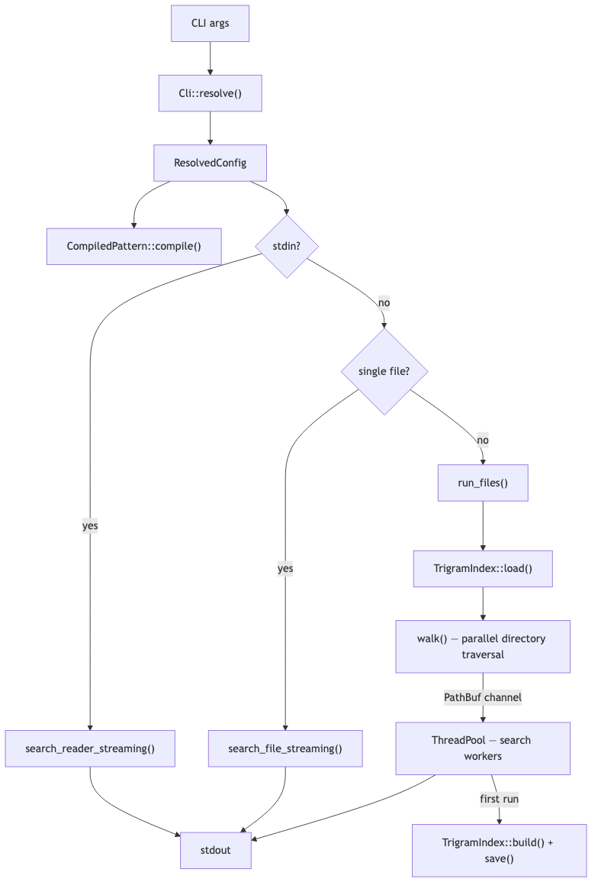
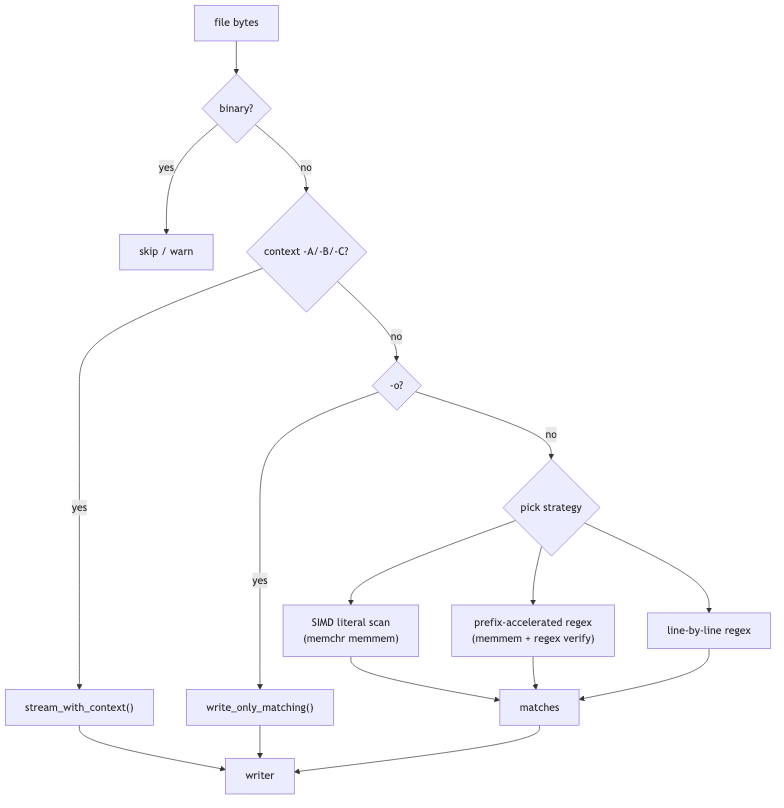
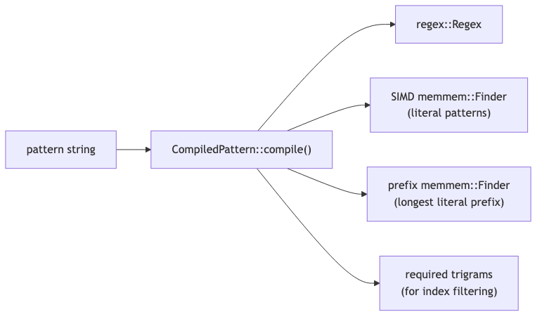
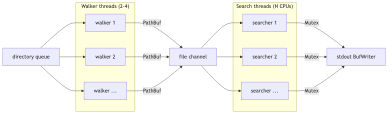
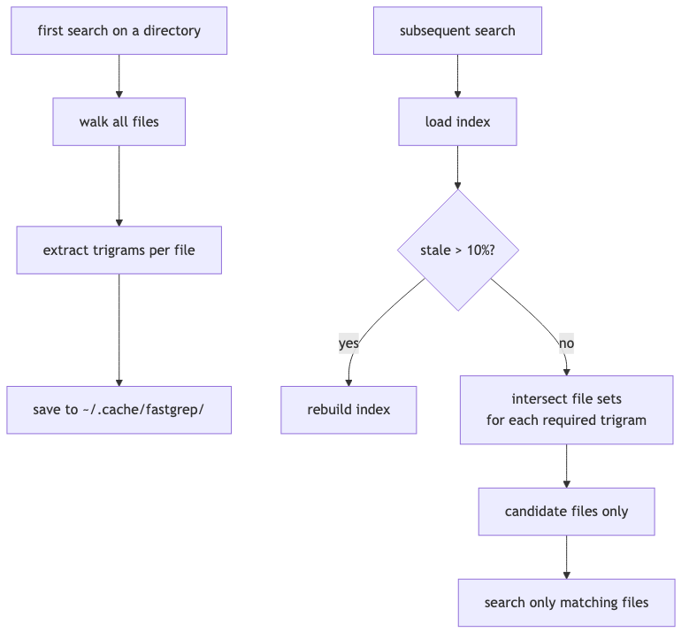

# Architecture

fastgrep is a parallel grep built in Rust.

- **Three execution paths**: stdin, single file (direct streaming), multi-file/recursive (parallel pipeline)
- **Parallel pipeline**: walker threads traverse directories → file paths sent via channel → search threads process files in parallel
- **Smart search strategy**: each file is searched using the fastest available method — SIMD literal scan, prefix-accelerated regex, or line-by-line regex
- **Streaming output**: results are written to stdout immediately under a shared lock, minimizing latency
- **Trigram index**: built on first run and cached to disk — on subsequent runs, only files containing the required byte sequences are searched

## Key design decisions

- **Streaming output** — results are written as found, minimizing latency for AI agents
- **SIMD-first search** — literal patterns use `memchr::memmem` (SIMD), regex patterns use prefix acceleration when possible
- **Trigram pre-filtering** — on repeated searches, only files containing all required 3-byte sequences are searched
- **Per-thread buffers** — reusable read/write buffers to avoid allocations in hot loops
- **mmap for large files** — files >256 KB are memory-mapped instead of heap-allocated
- **Parallel chunked search** — single files >4 MB are split across threads (disabled when context is active)
- **GNU grep output compatibility** — colors, separators, exit codes match GNU grep

## High-level overview



## Search pipeline



## Pattern compilation



## Parallel execution model



## Trigram index



## Module structure

```
src/
├── lib.rs           — public API re-exports
├── bin/grep.rs      — entry point, 3 execution paths (stdin/single/multi)
├── cli.rs           — clap args + ResolvedConfig
├── pattern.rs       — CompiledPattern (regex + SIMD accelerators)
├── searcher.rs      — search strategies + streaming output
├── output.rs        — OutputConfig + formatting (GNU grep compatible)
├── walker.rs        — parallel directory traversal with include/exclude
├── threadpool.rs    — simple fixed-size thread pool
└── trigram.rs       — trigram index build/load/query/evict
```
