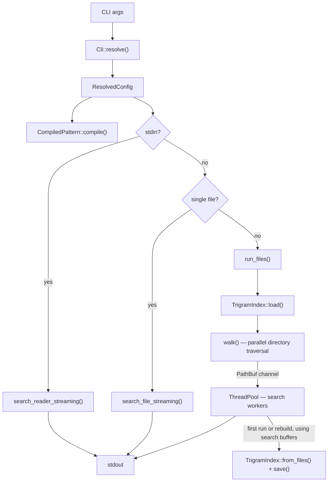
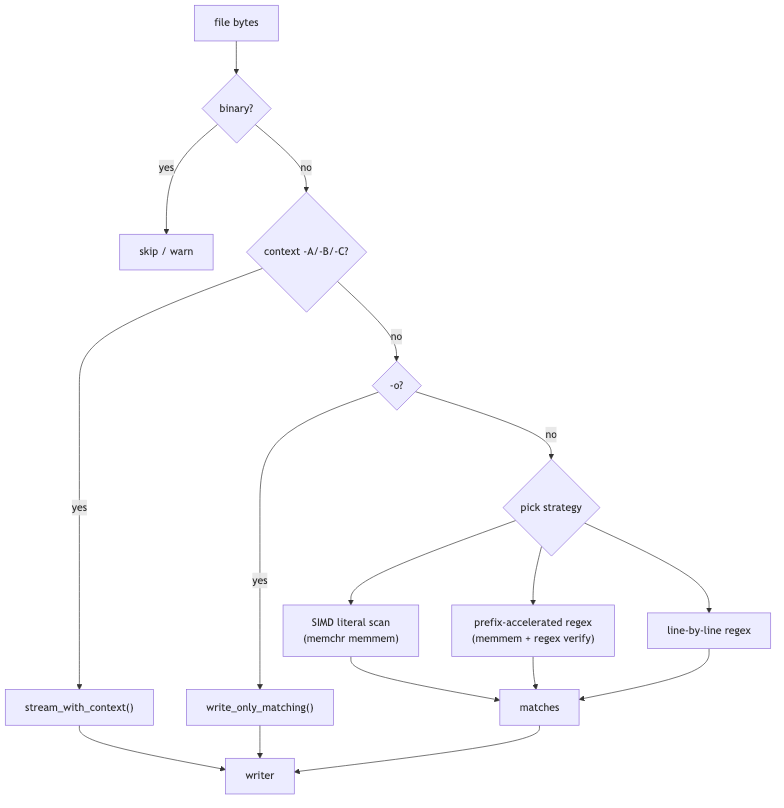
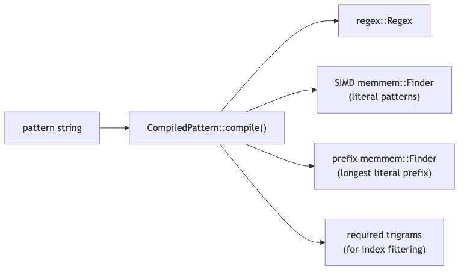
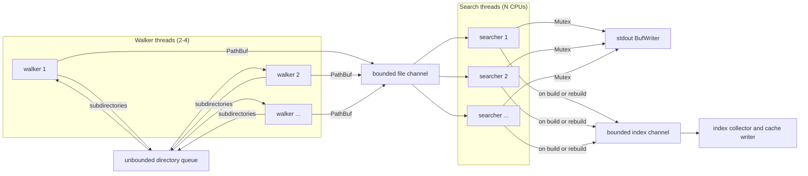
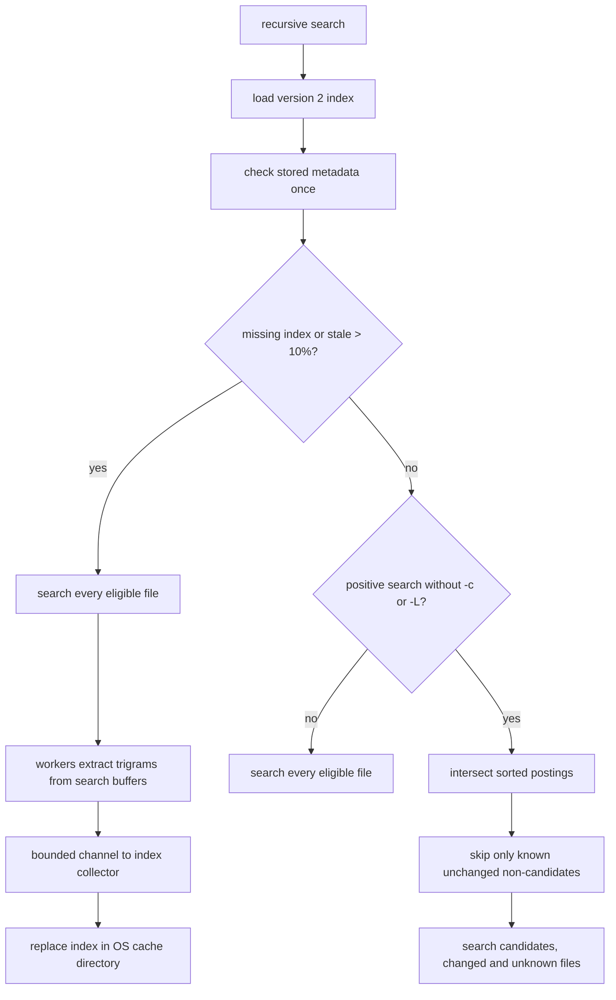

# Architecture

fastgrep is a parallel grep built in Rust.

- **Three execution paths**: stdin, single file (direct streaming), multi-file/recursive (parallel pipeline)
- **Parallel pipeline**: walker threads traverse directories → file paths sent via channel → search threads process files in parallel
- **Smart search strategy**: each file is searched using the fastest available method — SIMD literal scan, prefix-accelerated regex, or line-by-line regex
- **Streaming output**: results are written to stdout immediately under a shared lock, minimizing latency
- **Trigram index**: built from search buffers and cached to disk; subsequent runs skip only known, unchanged files with no required trigrams

## Key design decisions

- **Streaming output** — results are written as found, minimizing latency for AI agents
- **SIMD-first search** — literal patterns use `memchr::memmem` (SIMD), regex patterns use prefix acceleration when possible
- **Conservative trigram filtering** — unknown and changed files are always searched; `-v`, `-L`, and `-c` bypass filtering
- **Index maintenance** — check metadata once per plan; rebuild during the current search if more than 10% of records are stale. Workers extract unique trigrams from their existing buffers and send them through a bounded channel to an index collector
- **Sorted postings** — intersect sorted file-ID lists without allocating a hash set for each trigram
- **Directory scheduling** — an unbounded directory queue prevents walkers from blocking one another while producing tasks; file and index channels remain bounded
- **Per-thread buffers** — reusable read/write buffers to avoid allocations in hot loops
- **mmap for large files** — files >256 KB are memory-mapped instead of heap-allocated
- **Shared file search** — one output pipeline implements flags for both single-file and recursive searches; loading and parallelism are selected by the caller
- **Parallel chunked search** — single files >4 MB are split across threads (disabled when context or a match limit is active)
- **GNU grep output compatibility** — colors, separators, exit codes match GNU grep

## High-level overview


```mermaid
graph TD
    CLI["CLI args"] --> Resolve["Cli::resolve()"]
    Resolve --> Config["ResolvedConfig"]
    Config --> Pattern["CompiledPattern::compile()"]

    Config --> Stdin{"stdin?"}
    Stdin -->|yes| StdinPath["search_reader_streaming()"]
    Stdin -->|no| FileCount{"single file?"}
    FileCount -->|yes| SingleFile["search_file_streaming()"]
    FileCount -->|no| MultiFile["run_files()"]

    MultiFile --> Trigram["TrigramIndex::load()"]
    Trigram --> Walker["walk() — parallel directory traversal"]
    Walker -->|PathBuf channel| Pool["ThreadPool — search workers"]
    Pool --> Output["stdout"]

    StdinPath --> Output
    SingleFile --> Output

    Pool -->|first run or rebuild, using search buffers| BuildIndex["TrigramIndex::from_files() + save()"]
```

## Search pipeline



## Pattern compilation



## Parallel execution model


```mermaid
graph LR
    subgraph Walker ["Walker threads (2-4)"]
        W1["walker 1"]
        W2["walker 2"]
        W3["walker ..."]
    end

    subgraph Searcher ["Search threads (N CPUs)"]
        S1["searcher 1"]
        S2["searcher 2"]
        S3["searcher ..."]
    end

    DirQueue["unbounded directory queue"] --> W1 & W2 & W3
    W1 & W2 & W3 -->|PathBuf| FileChannel["bounded file channel"]
    FileChannel --> S1 & S2 & S3
    S1 & S2 & S3 -->|Mutex| Stdout["stdout BufWriter"]
    W1 & W2 & W3 -->|subdirectories| DirQueue
    S1 & S2 & S3 -->|on build or rebuild| IndexChannel["bounded index channel"]
    IndexChannel --> Index["index collector and cache writer"]
```

## Trigram index


```mermaid
graph TD
    Start["recursive search"] --> Load["load version 2 index"]
    Load --> Plan["check stored metadata once"]
    Plan --> Stale{"missing index or stale > 10%?"}
    Stale -->|yes| Full["search every eligible file"]
    Full --> Extract["workers extract trigrams from search buffers"]
    Extract --> Collect["bounded channel to index collector"]
    Collect --> Save["replace index in OS cache directory"]
    Stale -->|no| Mode{"positive search without -c or -L?"}
    Mode -->|no| Scan["search every eligible file"]
    Mode -->|yes| Filter["intersect sorted postings"]
    Filter --> Skip["skip only known unchanged non-candidates"]
    Skip --> Search["search candidates, changed and unknown files"]
```

## Module structure

```
src/
├── lib.rs           — public API re-exports
├── bin/grep.rs      — grep entry point
├── bin/fastgrep.rs  — fastgrep entry point
├── bin/common/     — shared CLI, 3 execution paths (stdin/single/multi)
├── cli.rs           — clap args + ResolvedConfig
├── pattern.rs       — CompiledPattern (regex + SIMD accelerators)
├── searcher.rs      — search strategies + streaming output
├── output.rs        — OutputConfig + formatting (GNU grep compatible)
├── walker.rs        — parallel directory traversal with include/exclude
├── threadpool.rs    — simple fixed-size thread pool
└── trigram.rs       — index snapshots, conservative query plans, build/load/query/evict
```
